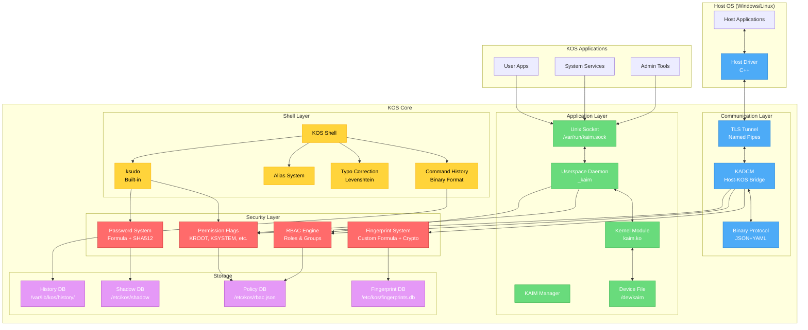
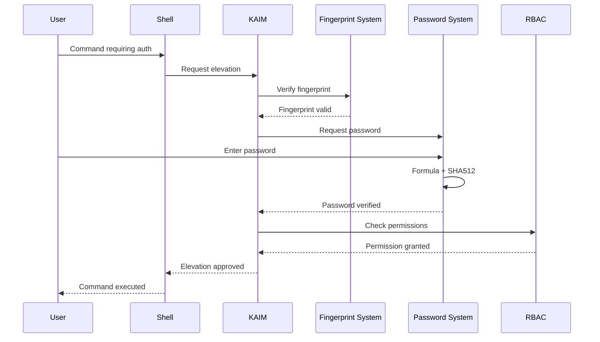
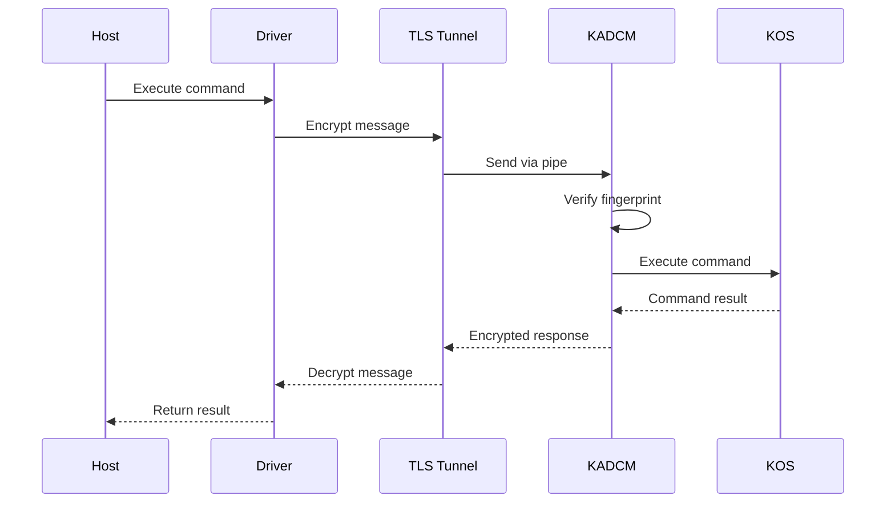
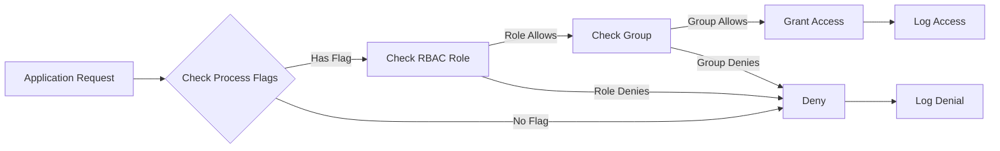
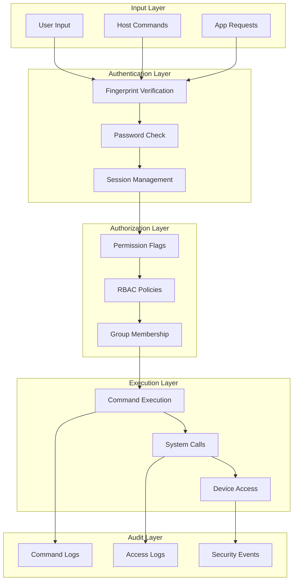
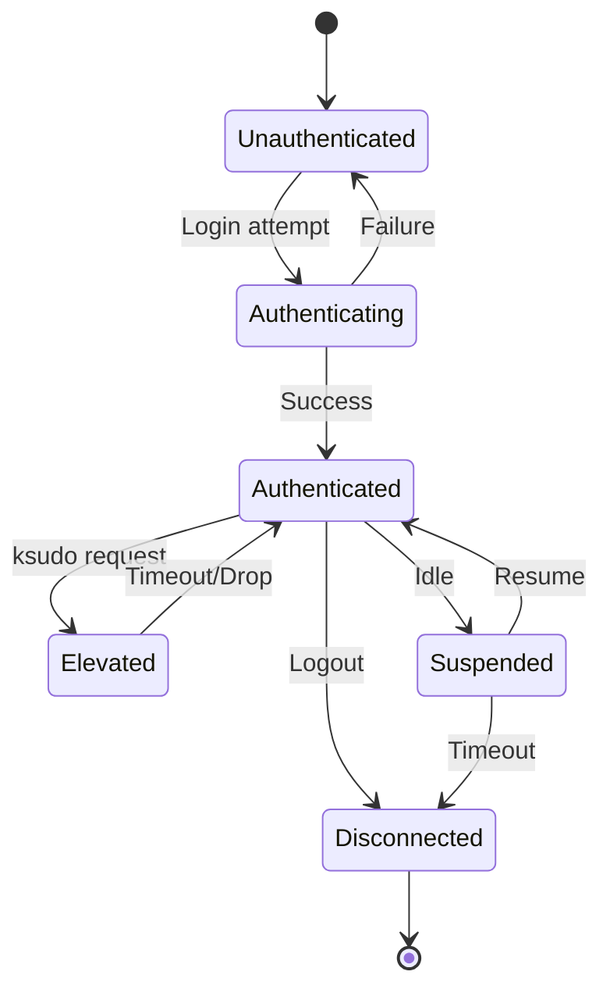

# KOS Architecture Diagram

## Component Flow Diagrams

### Authentication Flow

### Host-KOS Communication Flow

### Permission Check Flow

## Data Flow Architecture

## State Diagram - Session Lifecycle

